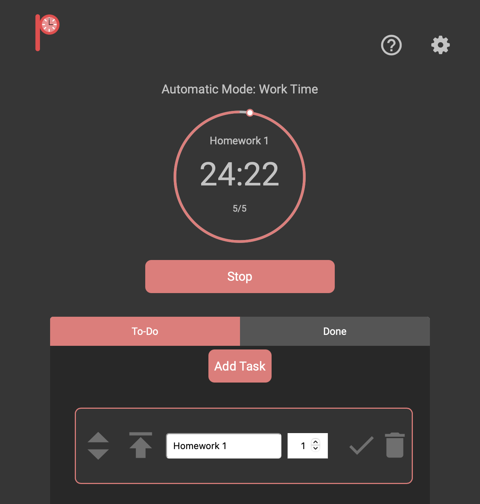

# [Pomodoro Timer](https://pomodorotimer.tech)
## Made by "The Procrastinators" (cse110-w21-group26)

 

# What Is Our Project?
## What Does Our Project Do?
 - Pomodoro Timer is a intuitive and sleek web application that promotes productivity and increases your efficiency working on your tasks. 
 - *"The Pomodoro Technique is a time management method developed by Francesco Cirillo in the late 1980s. The technique uses a timer to break down work into intervals, traditionally 25 minutes in length, separated by short breaks. Each interval is known as a pomodoro, from the Italian word for 'tomato', after the tomato-shaped kitchen timer that Cirillo used as a university student."* -[Wikipedia](https://en.wikipedia.org/wiki/Pomodoro_Technique)
  ## Why Our Project Promotes Efficiency And Is Useful
 - Using a minimalistic design, you're able to understand how to interact with the interface at great ease. 
 - You can plan out your tasks you need to be accomplished and our project will keep track of it.
 - In addition, with sound and different color schemes, it's simple to know what session you are currently on and how much time is remaining.
 - In addition, we have implemented a dark mode feature to help for those late night work sessions.
 - Unlike other websites that make you register for an account or having unneccsary clustered infromation, our website's simple yet efficient design makes sure not to take away anytime from you working on your tasks.
 
 

# The Team Behind The Project
 - Our [entire team](https://github.com/Michaelmvv/cse110-w21-group26/wiki) is made up of diverse undergraduate students from various disciplines at the University of California; San Diego.
 
 

# Want To Contribute To The Project?
 - Look at the `main` branch for deliverables and the `github-pages` branch for the code!
## How To Get The Files And Dependencies
 - To help and make contributions to the project, check out our page to learn how to [get started](https://github.com/Michaelmvv/cse110-w21-group26/wiki/Getting-Started).
## Documentation
 - Check out our Javascript documentation for our functions [here](https://github.com/Michaelmvv/cse110-w21-group26/wiki/API).
 
 

# Sources
 - [Circle Timer Reference](https://www.cssscript.com/circular-countdown-timer-javascript-css3/)
 - [Button Symbols](https://material.io/resources/icons/?style=baseline)
 - [Sounds](https://freesound.org/people/fennelliott/sounds/379419/)
